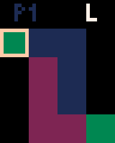

# Pyxel Games

This is small collection of games written in python using [pyxel](https://github.com/kitao/pyxel).

## Tic-Tac-Toe

### Controls
* `WASD` to move the cursor
* `space` to mark selected cell
* `Q` to forfit the match

## Sudoku Solver

### Controls
* `WASD` to move the cursor
* `0, ..., 9` to mark selected cell
* `space` to start solve
* `4, 1` to set the riddle fill percentage
* `enter` to generate riddle

### Approach
The general apporach used in this solver is a brute-force solve using back-tracking enhanced with a bit of domain knowledge such as what can actually go into any given cell at any point in time and that cells with less entry candidates are to be preferred/filled first.

This approach suffers from oscillations from time to time, by which I mean that the the back-tracking can get stuck in branch of the move-tree, and takes a very long time to get back out. To remedy this I added the ability to automatically restart the solve in the case it gets stuck below a given fill percentage for a given number of iterations.

### TODO
* Investigate a cleaner/more "determenistic" way to detect oscillations

## Lgame

### Controls
* `WASD` to move the cursor
* `space` to start, end, and terminate the selection
* `Q` to forfit the match

### TODO
* win/loss detection still has some bugs that should be fixed/removed

